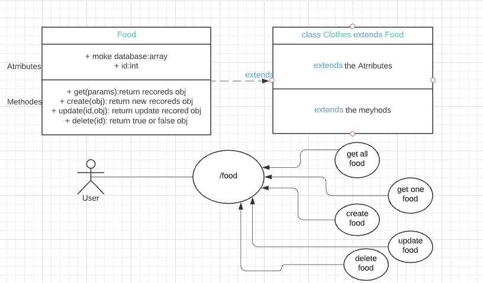

# basic-api-server

*  [PR](https://github.com/GhofranDayyat/basic-api-server/pull/4)
* [Herokue deploy link](https://basic-api-server-gh.herokuapp.com/)
* [GitHub Action](https://github.com/GhofranDayyat/basic-api-server/actions)

# UML
